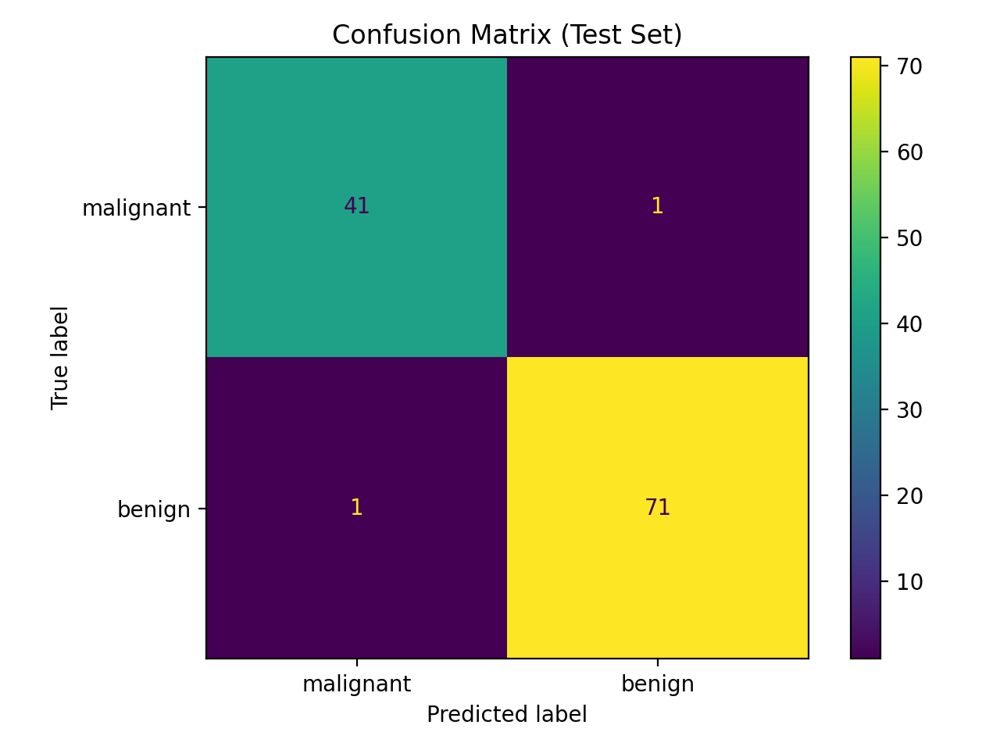
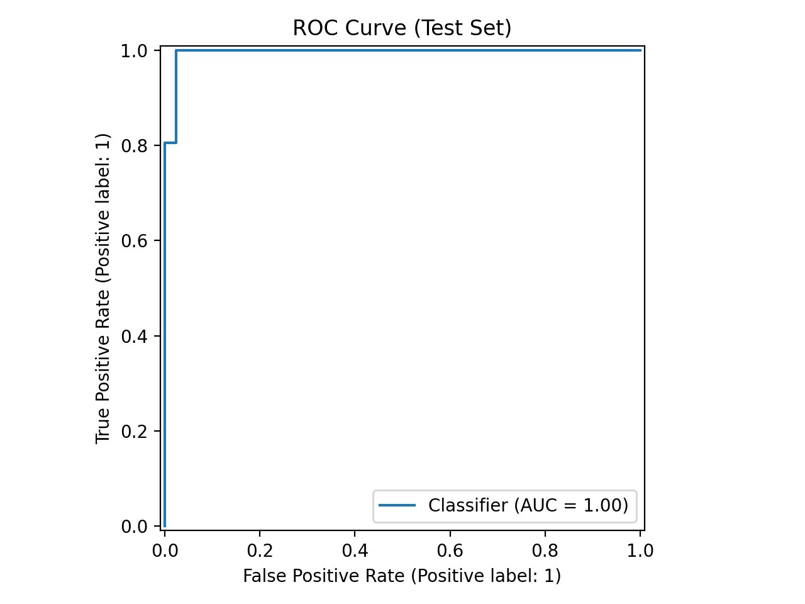
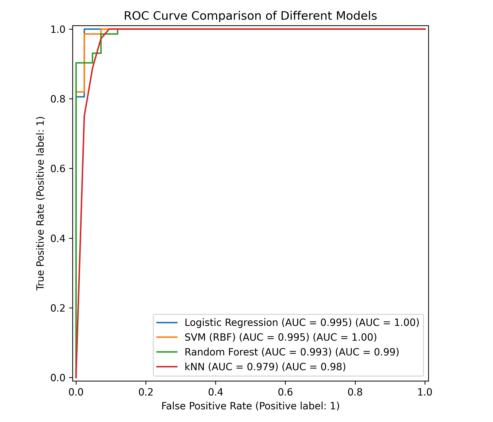
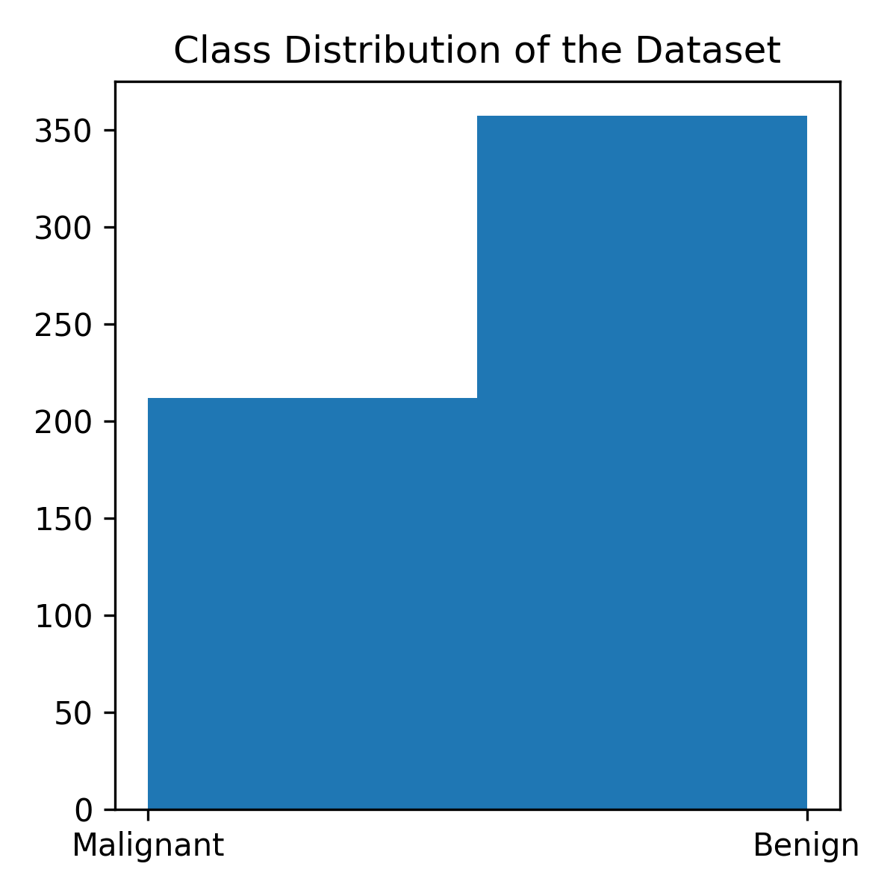
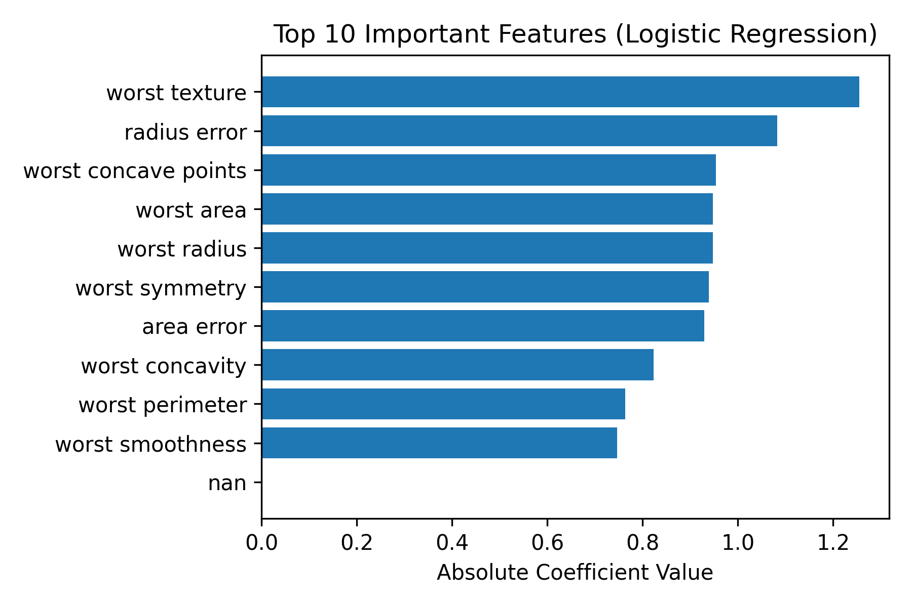

# BreastCancer-AI: An Interpretable Machine Learning Framework for Breast Tumor Classification Using the Wisconsin Diagnostic Dataset

## Overview

This project presents a **lightweight, interpretable machine learning framework** for **breast tumor classification** using the **Breast Cancer Wisconsin (Diagnostic) dataset (WDBC)**.

The goal of the project is to demonstrate how **classical machine learning models** can achieve **high diagnostic accuracy** while maintaining **interpretability and reproducibility**, which are essential for medical AI systems.

Instead of relying on complex deep learning architectures, this work explores how **well-engineered biomedical features combined with interpretable models** can provide strong performance for clinical decision support tasks.

The complete pipeline includes:

- Data preprocessing and normalization
- Logistic Regression classification
- Model comparison with multiple baselines
- Performance evaluation using clinical metrics
- Feature importance analysis
- Visualization of results (ROC curves, confusion matrix, feature importance)

The project also accompanies a **research-style academic manuscript** describing the methodology and experimental results.

---

# Dataset

This project uses the **Breast Cancer Wisconsin (Diagnostic) dataset (WDBC)** from the **UCI Machine Learning Repository**.

Dataset characteristics:

- **569 samples**
- **30 real-valued features**
- Features extracted from **digitized fine needle aspirate (FNA) images**
- Binary classification task:

| Label | Meaning |
|-----|------|
| Malignant | Cancerous tumor |
| Benign | Non-cancerous tumor |

Reference:

Wolberg W., Mangasarian O., Street N., Street W.  
Breast Cancer Wisconsin (Diagnostic) Dataset  
https://doi.org/10.24432/C5DW2B

---

# Machine Learning Pipeline
The classification pipeline follows a simple and reproducible workflow:

1. Load WDBC dataset
2. Perform **train-test split (80/20 stratified)**
3. Apply **z-score normalization**
4. Train **Logistic Regression classifier**
5. Evaluate using:

- Accuracy
- Sensitivity
- Specificity
- ROC-AUC
- Confusion Matrix

---

# Baseline Model Comparison

To contextualize the performance of logistic regression, we compare it with several classical machine learning models:

- Logistic Regression
- Support Vector Machine (RBF)
- Random Forest
- k-Nearest Neighbors (kNN)

| Model | Accuracy | ROC-AUC |
|------|------|------|
| Logistic Regression | 0.9825 | 0.9954 |
| SVM (RBF) | 0.9825 | 0.9950 |
| Random Forest | 0.9561 | 0.9931 |
| kNN | 0.9561 | 0.9788 |

Results show that **logistic regression achieves comparable performance to more complex models while offering greater interpretability.**

---

# Experimental Results

## Confusion Matrix

The confusion matrix demonstrates near-perfect classification with only two misclassified samples.

---

## ROC Curve

The ROC curve shows excellent threshold-independent discrimination with an AUC close to 1.0.

---

## ROC Comparison Across Models

All models achieve strong performance, with logistic regression and SVM showing nearly identical ROC curves.

---

## Dataset Class Distribution

The dataset contains slightly more benign samples than malignant ones.

---

## Feature Importance

Logistic regression coefficients allow direct interpretation of feature importance.

Key influential features include:

- worst texture
- radius error
- worst concave points
- worst area
- worst radius

These features correspond to known pathological indicators such as **nuclear irregularity, size variation, and morphological heterogeneity**.

---

# Key Insights

Several important observations emerge from the experiments:

1. The WDBC dataset is **highly separable**, allowing linear models to perform extremely well.

2. Increasing model complexity (e.g., Random Forest, SVM) provides **limited performance gains**.

3. Logistic regression offers strong advantages in:

- interpretability
- reproducibility
- computational efficiency

These properties are important for **medical AI applications where transparency and trust are required**.

---

# Research Context

This project was developed as part of an exploration into **interpretable medical artificial intelligence systems**.

The focus is on demonstrating how **classical machine learning approaches can remain highly competitive for structured biomedical datasets** while maintaining transparency and reproducibility.

---

# Future Work

Potential extensions include:

- Cross-validation for more robust performance estimation
- Probability calibration for clinical risk prediction
- External validation on independent cohorts
- Integration with imaging features
- Multimodal medical AI models

---

# References

1. Wolberg W., Mangasarian O., Street N., Street W.  
Breast Cancer Wisconsin (Diagnostic) Dataset  
UCI Machine Learning Repository.

2. Street W. N., Wolberg W. H., Mangasarian O. L.  
Nuclear Feature Extraction for Breast Tumor Diagnosis.  
SPIE Biomedical Imaging.

3. Pedregosa F. et al.  
Scikit-learn: Machine Learning in Python.  
Journal of Machine Learning Research.

---

# License

This project is released under the MIT License.

---

# Author

Weihao Cheng  
Hangzhou Dianzi University  

School of Communication Engineering  
School of Computer Science and Technology

## Citation

If you find this project useful, please cite:

Cheng, W.  
Interpretable Machine Learning for Breast Tumor Classification using the Wisconsin Diagnostic Dataset.
